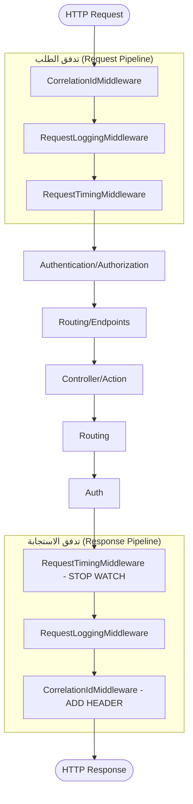

# مخطط خط أنابيب البرمجيات الوسيطة (Middleware Pipeline)
**إعداد: EZZALDEEN**

يوضح المخطط التالي كيفية تدفق طلب HTTP عبر البرمجيات الوسيطة المختلفة قبل الوصول إلى المتحكم (Controller) وكيفية عودة الاستجابة:

### أهمية ترتيب البرمجيات الوسيطة:
الترتيب الذي يتم به تسجيل البرمجيات الوسيطة في `Program.cs` أمر بالغ الأهمية:
- **Correlation ID:** يجب أن يكون في البداية لضمان وجود المعرف في كافة السجلات.
- **Logging:** يجب أن يكون مبكراً لالتقاط الطلب بالكامل.
- **Authentication:** يجب أن يسبق **Authorization**.
- **Authorization:** يجب أن يسبق **Endpoints**.

---
*تم إعداد هذا المخطط لتمثيل الترتيب المطبق في مشاريع الأسبوع العاشر.*
